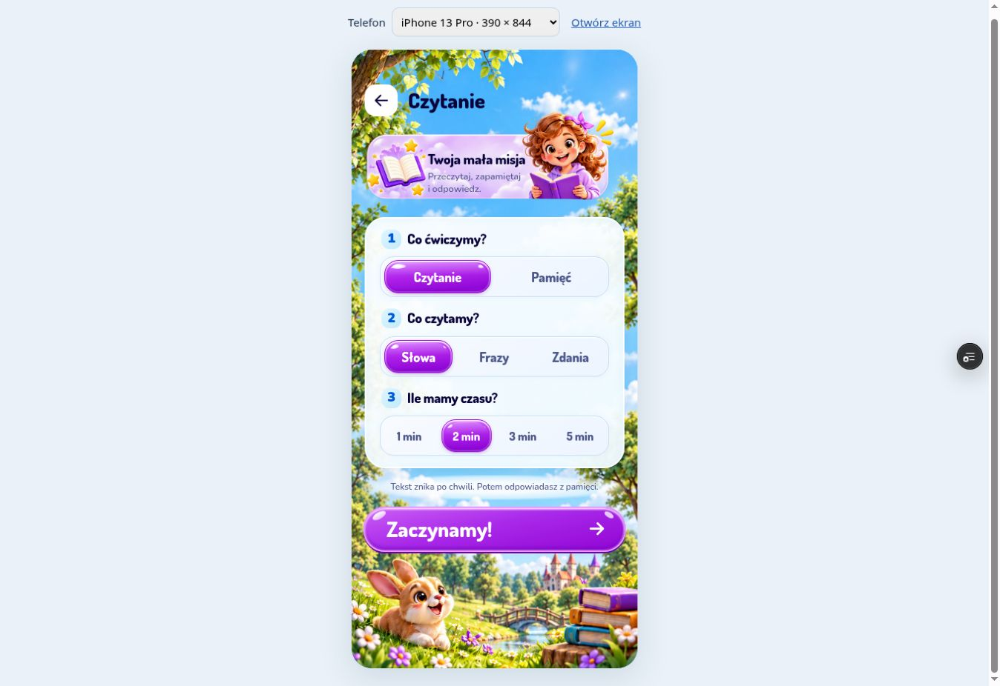

# Reading settings — visual QA

Implementation branch: `czytanie-v1`. UI revision: `7ab0b7f`.

Three visual iterations compared the supplied reference with a 390 × 844
Chrome preview using simulated 47 px top and 34 px bottom safe areas.
The shared Jelly controller and rounded type follow the orthography screen.

Measured UI geometry in CSS pixels:

| Element | x | y | Width | Height |
| --- | ---: | ---: | ---: | ---: |
| Settings card | 18 | 228 | 354 | 343 |
| Start button | 16 | 622.59 | 358 | 62 |
| Mission artwork including protruding character | 18 | 81 | 340 | 127 |

Verified reading/memory selection, conditional level controls, duration
selection, and starting a one-minute phrase round. The four automated Jelly
and offline-release tests pass.

This is not a claim of complete pixel equality: the reconstructed illustration
assets differ from the raster reference. Real iPhone Safari rendering has not
been verified. The reference status bar is device chrome, not app UI.

