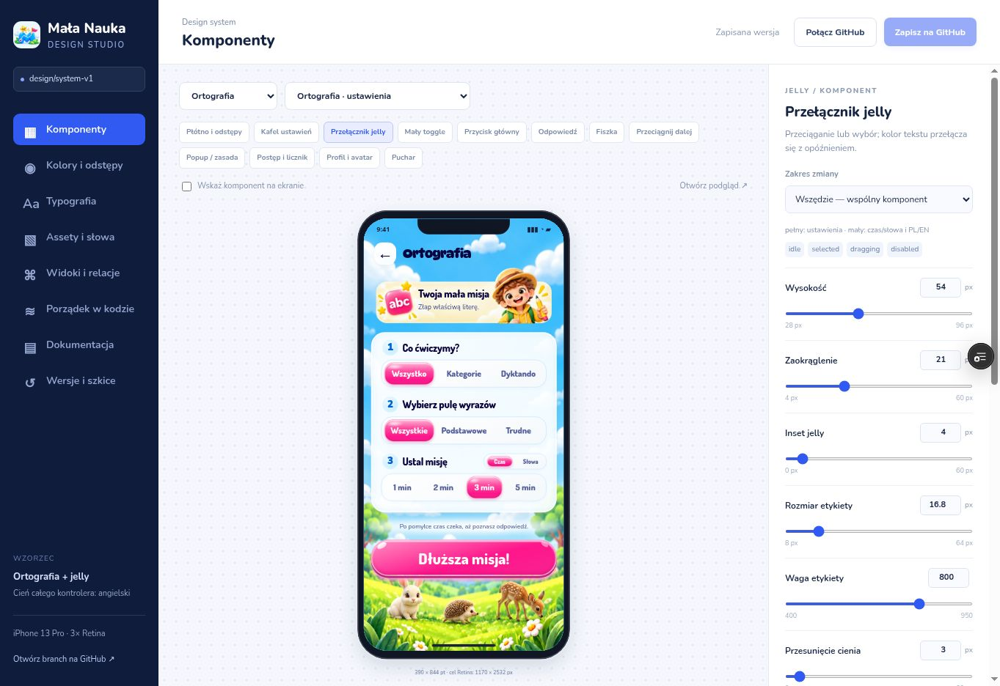

# Mała Nauka · Design System v1

Panel: `/design-system/` na branchu **design/system-v1**. To wspólny kontrakt wyglądu, komponentów i ilustracji oraz narzędzie do jego edycji.

## Zacznij od panelu

1. **Komponenty → Według widoku**: wybierz ekran i wskaż element pastylką lub kliknięciem. Nieobecne elementy są ukryte albo wyszarzone.
2. **Według elementu → Porównaj użycia**: zaznacz ekrany do porównania. Telefony mają 390 × 844 bez skalowania i układają się obok siebie, jeśli jest miejsce.
3. Zmieniaj suwaki, oglądając znacznik **Ostatnio zapisano**. Wybierz instancję/kontener i przełącz jego stan. **Warstwy i widoczność** pozwalają chwilowo ukryć element z zachowaniem miejsca albo z przesunięciem pozostałych.
4. **Typografia** pokazuje fonty, role i miejsca użycia. **Baza słów i grafik** pokazuje miniatury, wspólne zasady i powiązania grafik ze słowami; umożliwia ich scalenie.
5. **Animacje**: wybierz dwa ekrany, ustaw ruch i uruchom Play lub Pętlę z przerwą.
6. **Cofnij / Ponów** obejmują wygląd, zasady i grafiki. **?** otwiera pomoc z przykładami. Szkic przetrwa odświeżenie w tej przeglądarce.
7. **Połącz GitHub → Zapisz na GitHub**: przejrzyj zmiany i zapisz jeden commit na tym branchu. Konflikty rozstrzygaj kartami „Twoja wersja” / „Zapisana na GitHub”.

Pełna instrukcja bez wiedzy o kodzie: **[Praca wizualna](visual-guide.md)**.

## Dokumenty

| Dokument | Zakres |
| --- | --- |
| [Praca wizualna](visual-guide.md) | Scenariusze dla użytkownika: wybór, porównanie, warstwy, zasady, grafiki i animacje |
| [Zasady i tokeny](principles.md) | Wzorzec ortografii, cień z angielskiego, geometria, warianty, Retina |
| [Komponenty i widoki](components.md) | Katalog, stany, warunki, relacje, fonty |
| [Assety i branche](assets-and-branches.md) | Jedna baza, deduplikacja, konsumenci, caching |
| [Zapis i rozwój](development.md) | Git, konflikty, pliki, build, porządkowanie, zasady mockupów |
| [Weryfikacja](verification.md) | Testy, przegląd wizualny, granice symulacji |

Źródłami prawdy są `config.json`, `registry.json`, `assets.json` i `rules.json`. Dokumentacja wyjaśnia kontrakt; nie tworzy drugiej kopii jego wartości.
