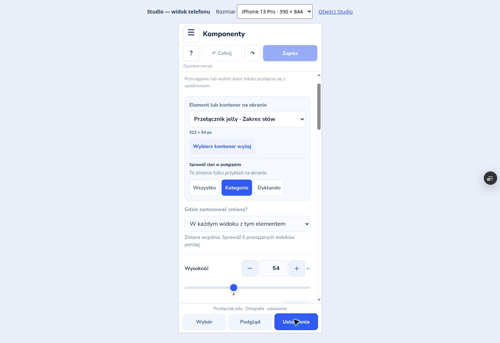

# Design Studio na telefonie

Otwórz ten sam adres `/design-system/` co na komputerze. Układ telefonu włącza się automatycznie przy szerokości do 690 px. Edytujesz te same elementy, zasady i grafiki.

## Szybka poprawka wyglądu

1. W **Wybór** wskaż widok i pastylkę elementu. Studio pokaże jego podgląd.
2. Dotknij **Ustawienia**. Zmień wartość suwakiem, przyciskami **− / +** albo wpisz liczbę.
3. **Ostatnio zapisano** i znacznik na suwaku pokazują punkt odniesienia. **Przywróć** cofa tę wartość; **Cofnij** na górze cofa ostatnią zmianę.
4. Przełącz na **Podgląd**, aby obejrzeć efekt. Powrót do ustawień zachowuje stan przykładu i miejsce przewijania.

W **Sprawdź stan w podglądzie** możesz wybrać np. **Kategorie**. Studio od razu pokazuje ten stan; powrót do ustawień pozwala pracować na aktywnym kontenerze.

## Kilka ekranów

W ustawieniach elementu wybierz **Porównaj użycia**. Przesuwaj ekrany poziomo palcem po nagłówku lub marginesie obok ramki. Nagłówek **Edytuj ten ekran** otwiera jego ustawienia. Listę ekranów zmienisz w **Wybór**.

Każdy ekran aplikacji nadal renderuje się w 390 × 844. **Dopasuj ekran** skaluje ramki porównania do dostępnej wysokości. Ekrany pozostają obok siebie i przewijają się poziomo; tryb 100% zachowuje naturalny rozmiar.

Opcja **100% — rzeczywisty rozmiar** dla pojedynczego podglądu pozwala oglądać detale przez przewijanie. **Dopasuj telefon** przywraca widok całego ekranu.

## Słowa, grafiki, fonty i animacje

Przycisk **☰** otwiera **Sekcje studia**. W bazie wybierz **Słowa**, **Grafiki** lub **Zasady**, a następnie użyj wyszukiwania i filtra. Okna mają duże pola, przyciski oraz **×** do zamknięcia. Fonty i ich użycia są dostępne w **Typografia**.

W **Animacje → Guziki i slidery** wybierz Jelly, błąd albo wynik. Pod kategoriami zobaczysz jej grupy w kolejności od wspólnego ruchu do efektów danego elementu. Dotknięcie grupy otwiera dokładnie jej zwinięte ustawienia, a przycisk **Otwórz podgląd** prowadzi do prawdziwego ekranu gry. **Ustawienia** zawierają też presety wspólnego charakteru ruchu. Uchwyt ma tę samą deformację Jelly co w Komponentach. W **Przejścia między ekranami → Wybór** wskaż dwa ekrany; **Podgląd** zawiera odtwarzanie, pętlę i przerwę. Wyjście z podglądu zatrzymuje pętlę.

## Zapis i praca na drugim urządzeniu

**Zapisz** znajduje się u góry. **Połącz GitHub** jest w menu sekcji. Podsumowanie zmian i rozstrzyganie konfliktów korzystają z dotychczasowego procesu zapisu.

Szkic pozostaje w używanej przeglądarce. Aby kontynuować na drugim urządzeniu, zapisz zmiany na GitHub, a tam wybierz **Wersje i szkice → Wczytaj i scal z GitHub**.

[Pełna instrukcja pracy wizualnej](visual-guide.md) · [Zakres sprawdzenia](verification.md)
