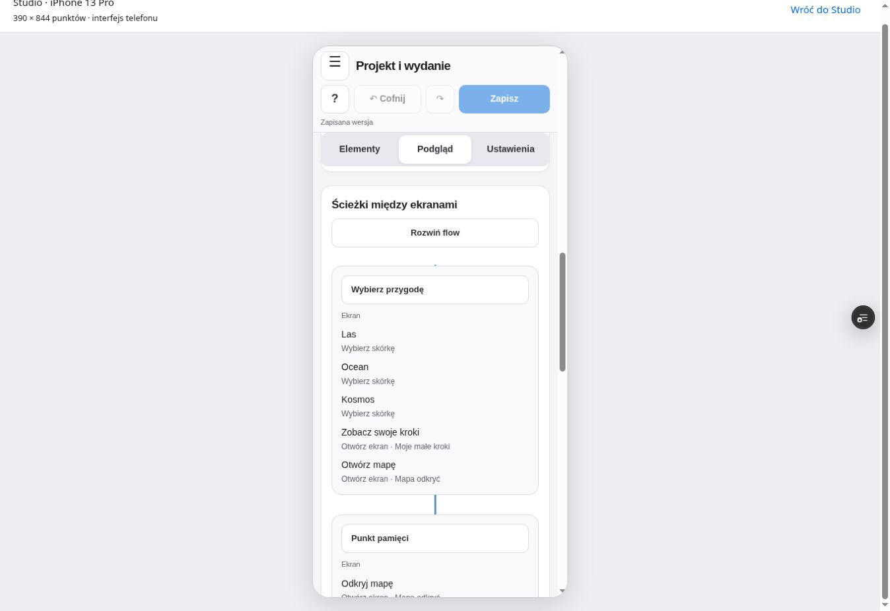

# Projekt i wydanie — od pomysłu do pilota

Studio używa spokojnych powierzchni, systemowego fontu, wyraźnych akcji i dużych pól dotykowych. Nowy język wizualny dotyczy narzędzia. Podgląd gry zachowuje własne fonty, jelly i wspólny kontrakt.

## Przejdź gotowy przykład

Otwórz **Projekt i wydanie**. Zapisany przykład „Wyspa małych odkrywców” ma pięć ekranów, sześć zadań i trzy wersje. „Centrum przygody” otwiera mapę, postępy albo wybór przygody trzema opcjami jelly. Mapa korzysta z istniejącej, wspólnej ilustracji żółwia; nie powstaje drugi folder z assetami.

1. **Plan**: wybierz zadanie, priorytet, termin, czas i poprzedniki. Czerwone odcinki pokazują najdłuższą pozostałą ścieżkę. Zakończone zadania nie wydłużają planu. To dni kalendarzowe, bez harmonogramowania osób. Zagrożony termin jest ostrzeżeniem; cykl zależności blokuje wersję testową.
2. **Ekrany i flow**: wybierz ekran, dodaj komponent i ustaw jego własny tekst, geometrię, widoczność, stan i funkcję. Opcje jelly mają osobne cele i wartości. „Wybieraj elementy” zaznacza warstwę; „Testuj kliknięcia” wykonuje akcję. Zdarzenia pamięci, pucharu, combo, odpowiedzi i pomyłki mogą otwierać wybrane ekrany. Nagroda pamięci ma pierwszeństwo.
3. **Teksty**: edytuj element nowego ekranu albo wybierz istniejący widok. Skan dotyczy statycznych napisów. Podmiana zachowuje kontrolki i ich obsługę; imiona, słowa gry i wyniki nie są tekstami do globalnej podmiany. Powtarzający się, niejednoznaczny napis jest wyłączony. Kopia wersji zachowuje teksty z chwili jej utworzenia.
4. **Postępy i nagrody**: suwaki mają znacznik oraz zapisane lub startowe wartości i przycisk przywracania. Poziomy są oddzielnymi polami liczbowymi. Zmieniaj progi skórek, pucharów, rodzin i wyzwań, potem sprawdzaj ten sam scenariusz danych w labie.
5. **Test i dane**: nowy gracz, sześć odpowiedzi, siódma odpowiedź, pomyłki i podpowiedzi, powroty po czasie oraz większa próbka. Numer próbki pozwala odtworzyć dane. Próba z długim tytułem zmienia wyłącznie podgląd. Dziennik i liczniki pokazują skutki akcji. Są to dane syntetyczne; test nie zapisuje wyników dzieci.
6. **Wersje i wydanie**: zapisz wersję, udostępnij ją i zbierz uwagi. Recenzent wybiera również istniejące widoki z lokalnymi podmianami tekstów. „Skopiuj uwagi dla autora” tworzy pakiet do importu; niczego sam nie wysyła. Uwagi trafiają do wersji o zgodnym identyfikatorze i odcisku. Edytuj szkic, zapisz kolejną wersję, zakończ cztery kontrole i rozwiąż uwagi przed zatwierdzeniem.

## Mechanika małych kroków

| Ustawienie | Wartość początkowa | Znaczenie |
| --- | --- | --- |
| Punkt pamięci | 1 za 7 odpowiedzi | Różne słowa, pierwsza próba danego dnia, samodzielnie |
| Fragment mapy | koszt 1 punktu | Jeden fragment można odkryć tylko raz |
| Combo | co 3, bonus 1, maks. 2 na rundę | Wyłącznie wynik; bez przyspieszania opanowania |
| Opanowanie | 3 różne dni, odstęp co najmniej 7 dni | Wymaga powrotów; punkt mapy nie oznacza utrwalenia |
| Poziomy | 0 / 3 / 10 / 25 opanowanych słów | Widoczny postęp w nauce |
| Skórki | Las od początku, Ocean po 3, Kosmos po 6 fragmentach | Bez płatności i odbierania nagród po błędzie |

Pomyłka nie odbiera zdobytych punktów ani fragmentów. Powtórka tego samego słowa dziś, podpowiedź i druga próba nie nabijają waluty. Słowo z kilkoma kategoriami nadal jest jednym słowem. Próbki usuwają duplikaty i korzystają z automatycznego przypisania rodzin. Odblokowania i puchary są oddzielone od oceny „Umiem”.

## Telefon i desktop

Na desktopie jest lista elementów, podgląd i inspektor. Na telefonie przełączaj **Elementy / Podgląd / Ustawienia**. Wybór ekranu i trybu pracy jest zwinięty, żeby zostawić miejsce na podgląd. Przełącznik paneli pozostaje pod nagłówkiem. Wskazanie elementu otwiera jego ustawienia. Desktopowy link „Sprawdź Studio na telefonie” uruchamia tę samą aplikację w ramce 390 × 844.

Ramka sprawdza układ, dostępność pól i klikalność w Chrome. Nie zastępuje testu na fizycznym iPhonie, Safari ani pomiaru zużycia energii. Studio nie pokazuje wymyślonych watów czy fizycznego obciążenia CPU/GPU. Istniejący lab efektów opisuje rzeczywiście dostępne FPS, czas JavaScript i opcjonalną pamięć JS; jego kolory są wskazówkami, a nie pomiarem całego urządzenia.

## Szkic, Git i deployment

„Zapisz na GitHub” zapisuje projekt na **design/system-v1**. Sam szkic wyglądu nie zastępuje zatwierdzonego kontraktu. Dopiero ustawienie zatwierdzonej wersji jako pilota i zapis commitu stosuje jej zamrożony wygląd oraz lokalne teksty. Adres nowych ekranów: `/design-system/experience.html`.

Ten pilot służy testowaniu nowej mechaniki na danych syntetycznych. Włączenie jej do istniejącej rozgrywki i trwałych wyników graczy jest następnym etapem integracji. Produkcyjny `main` pozostaje osobnym wydaniem.

Przeglądarkowy zapis Git wymaga połączenia z uprawnieniem Contents do repozytorium. Token zostaje w pamięci karty. Końcowy projekt tej próby utworzono wyłącznie przez UI, wyeksportowano przyciskiem „Skopiuj projekt” i zapisano na branch przez istniejące połączenie GitHub. Formularza Git w przeglądarce nie testowano rzeczywistym osobistym tokenem; jego transakcja, walidacja i konflikty są objęte testami transportu.

„Sprawdź wdrożenie” odczytuje rzeczywisty status Vercel dla commitu z GitHub. Pokazuje gotowe / w toku / błąd / niedostępny. Numer commitu pochodzi z zapisu lub metadanych aktualnego buildu. Błąd API nie jest zielonym statusem. Chroniony preview wymaga linku dostępu tego samego deploymentu; link wygasa niezależnie od zamrożenia danych projektu.

Po zmianie rewizji serwera Studio oferuje odzyskanie starszego szkicu. Nowe szkice zachowują podstawę do porównania trzech wersji. Rozbieżne ustawienia wymagają wyboru kartami; pozostałe łączą się automatycznie. Kopia starszego szkicu zostaje w lokalnym odzyskiwaniu. Historyczne szkice bez podstawy umożliwiają odzyskanie projektu; pełne ustawienia można pobrać do przeglądu. Szkic na innym urządzeniu przenoś przez Git lub eksport/import; pamięć przeglądarek nie jest wspólna.

## Źródła i sprawdzony przykład

Strona wskazana jako inspiracja — https://www.designmd.co/d/apple — odpowiadała 403 w narzędziu odczytu. Nie przypisujemy jej niewidzianych reguł. Rozwiązania Studio oparto na czytelnej hierarchii, układzie i języku interfejsu opisanym przez Apple:

- https://developer.apple.com/design/human-interface-guidelines/layout
- https://developer.apple.com/design/human-interface-guidelines/designing-for-ios
- https://developer.apple.com/design/human-interface-guidelines/writing

Projekt wykonany w UI: [wyspa-ui-project.json](wyspa-ui-project.json). Jest to odtwarzalny przykład, nie drugie źródło aktywnych reguł. Kontraktem pozostaje `design-system/config.json`. Przebieg pętli i trzech kolejnych przelotów: [project-verification.md](project-verification.md).
