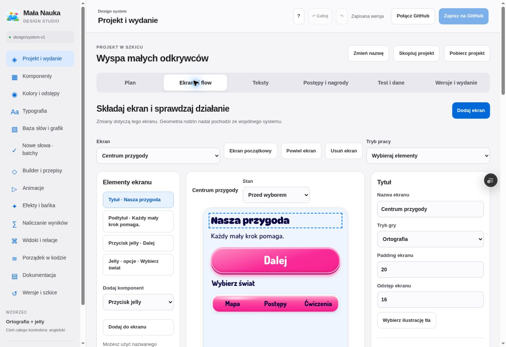

# Weryfikacja projektu — 5 października 2026

## Scenariusz wyłącznie przez Studio

Uruchomiono wyspę, dodano „Centrum przygody” i jelly Mapa / Postępy / Ćwiczenia. Każda opcja prowadzi do innego ekranu. „Dalej” dostał lokalną funkcję; centrum ustawiono jako początek. Wybierak assetów przypisał wspólną ilustrację żółwia mapie. Zmieniono priorytet i termin zadania. Skan 30 statycznych napisów w ustawieniach ortografii pozwolił zmienić nagłówek na „Twoja spokojna przygoda”.

Próba 6 → 7 pokazała punkt pamięci; pomyłka go nie odebrała. Odkrycie fragmentu wyłączyło ten fragment i pozostałe przy braku salda. Próba powrotów po 4 i 8 dniach pokazała 36 odpowiedzi, 12 opanowanych słów, poziom 3 i 5 punktów pamięci.

Zapisano „Wyspa — próba 1”. Osoba testująca otworzyła link, wykonała odpowiedź, dodała uwagę i skopiowała pakiet. Import przypisał uwagę do tej wersji. Zatwierdzenie przed kontrolami zostało zablokowane. Po zmianie tytułu centrum na „Nasza przygoda” zapisano drugą wersję. Reset wcześniejszego podglądu nadal pokazał „Małe odkrycia”, a eksport potwierdził dwa różne tytuły. Cztery kontrole i rozwiązanie uwagi poprzedziły zatwierdzenie pilota. Git nie był zastępowany ukrytą modyfikacją danych podczas budowania projektu.

Przeszkody usunięte w pętli: osobne funkcje opcji jelly; kliknięcie pierwszej opcji przechwytywane przez pointer capture; statyczne teksty wewnątrz złożonych etykiet; automatyczne skanowanie po załadowaniu; wyszukiwanie assetu po słowie; odświeżanie kodu Studio z zachowaniem szkicu; kopiowanie projektu do schowka.

## Trzy dodatkowe przeloty

| Przelot | Próba | Usprawnienie i potwierdzenie |
| --- | --- | --- |
| 1 — desktop | Zmiana reguły, przywrócenie, nowy poziom, własny cel nagrody, tekst do recenzji | Suwak 7 → 8 → Przywróć 7; znacznik wartości; poziom 5 dodany z progiem 35 i usunięty; siódma odpowiedź otworzyła wybraną mapę; zamrożony widok ortografii zachował nowy nagłówek i działające Kategorie |
| 2 — telefon | Elementy → ustawienia → podgląd; zmiana szerokości; widoczność | Tytuł osiągnął 300 px, potem automatyczny wymiar został przywrócony; ukrycie zachowało 29,89 px wysokości; szerokość body i scrollWidth wyniosły po 375 px w ramce 390 px ze scrollbar; zwinięte kontrolki ekranu i sticky przełącznik paneli |
| 3 — zapis i konflikty | Nowa rewizja, niezależne i kolidujące zmiany, faktyczny deployment | Nowe szkice zachowują podstawę, starsze nie są automatycznie nadpisywane; scalanie niezależnych tokenów i zatrzymanie konfliktu sprawdzone testem; metadane buildu wskazują commit; UI odczytuje status GitHub/Vercel, bez fikcyjnej dostępności |

Po przelotach zapisano trzecią zamrożoną wersję „Wyspa — pilot po 3 przelotach”, zakończono kontrole i wybrano ją do wydania na branchu.

## Automatyczne sprawdzenie i granice

`node tools/build-design.mjs` kontroluje zależności importów, katalog i odwołania oraz tworzy metadata wdrożenia. `node --test tests/*.test.mjs`: 98 testów po zapisie końcowego kontraktu — wszystkie przeszły. Testy obejmują brak farmienia punktów, granice combo, utrwalenie, idempotentne zdarzenia, koszt mapy, skórki, DAG, blokady wydania, zamrożenie, niewłaściwe assety, pakiety uwag, odzyskiwanie i status deployu oraz istniejące tryby gry.

Przegląd UI wykonano przez przeglądarkę Chrome, w desktopie i mobilnej ramce 390 × 844. Nie deklarujemy testu fizycznego iPhone ani Safari. Upload nowego pliku był wcześniej sprawdzony w warstwie transakcji; w tej próbie użyto istniejącego assetu. Kopiowanie pakietów i import sprawdzono realnie, pobierania przez automatyzację przeglądarki nie użyto. Recenzja jest pakietem eksport/import, nie usługą równoczesnego współedytowania.

Końcowy test w UI pokazał dialog starszego szkicu dla rewizji 1 → 2. „Przejrzyj i odzyskaj” zachowało trzy wersje i aktualnego pilota. „Sprawdź wdrożenie” pokazało „Wdrożenie gotowe · 281f9c4 · Deployment has completed”. Przegląd ten ujawnił i usunął błąd receivera natywnego fetch; osobny test regresji go kontroluje. Wszystkie sześć adapterów konsumentów zbudowały się bez lokalnych assetów i paczek słów, z kompletnym grafem importów, a ich deploymenty osiągnęły READY. Produkcyjny main nadal wskazuje f16b7770c6473f692284ecd44f3a282bfa5d3829.

