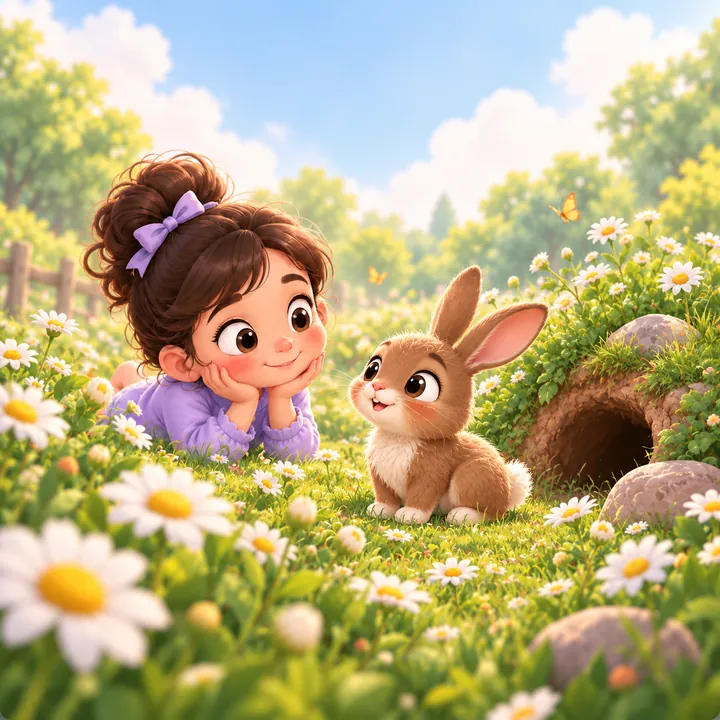
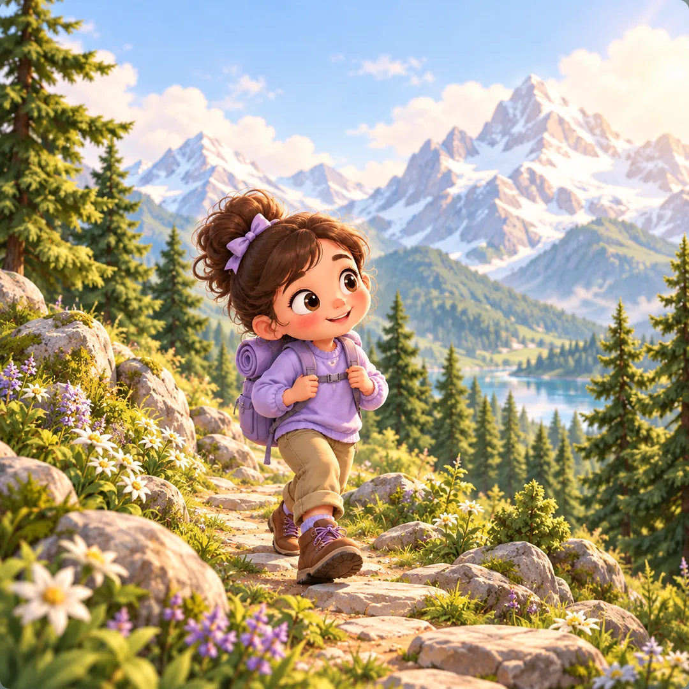

Moduł ortografii Małej Nauki. W czasie migracji zachowujemy aktualny działający wariant v0.3 i dopiero później porządkujemy zależności wspólne.

## Review ilustracji WebP — 14.09.2026

Pierwsza partia zastępuje trzy proste SVG ilustracjami w kierunku zaakceptowanych makiet. Podmiana dotyczy plików w `assets/scenes/`, przypisań w `spelling/scenes.mjs` i listy/wersji cache w `sw.js`. Cache obejmuje również wersjonowane adresy skryptów i stylów używane przez ortografię, aby pierwszy start offline wczytywał tę samą warstwę wizualną. Nawigacja offline z parametrami review używa zapisanego dokumentu modułu.

| Słowo | Asset | Rozmiar obrazu | Waga |
| --- | --- | --- | --- |
| róża | `assets/scenes/rose.webp` | 720×720 | 67,7 KiB |
| królik | `assets/scenes/bunny.webp` | 720×720 | 72,2 KiB |
| góra / góry | `assets/scenes/mountains.webp` | 720×720 | 101,3 KiB |

Cały zestaw: 241,2 KiB. WebP, jakość 80, effort 6; wspólna ilustracja obsługuje oba układy. Bez wrysowanych słów, przycisków i bąbli — interfejs pozostaje HTML/CSS. Obrazy są lokalne i objęte cache offline, bez CDN.

Review na adresie danego preview:

- `/ortografia/?assets=1` — wyłącznie trzy słowa z dostępnymi ilustracjami, losowy układ;
- `/ortografia/?assets=1&scene=rose&layout=full` — róża, pełny układ;
- `/ortografia/?assets=1&scene=bunny&layout=split` — królik, spokojniejszy dół;
- `/ortografia/?assets=1&scene=mountains&layout=full` — góra, pełny układ.

Po otwarciu kliknij „Zaczynamy!”. Parametr `layout` można zmieniać pomiędzy `full` i `split`, a `scene` pomiędzy `rose`, `bunny` i `mountains`. W tej partii nie zmieniono mechaniki, typografii ani pozostałych modułów; kolejne sceny i dalszy szlif interfejsu po review.

Ilustracje powstały wbudowanym ImageGen na podstawie dostarczonej makiety ogrodu różanego; kolejne obrazy wykorzystały pierwszy jako referencję stylu. Wspólny prompt: „Polished soft pastel 3D storybook illustration for Mała Nauka, warm light, rounded friendly shapes, detailed painterly scenery. Square full bleed scene, central subject, calm pale sky above. No text, letters, numbers, UI, buttons, cards, bubbles, phone frames or signboards.” Tematy: różany ogród z dzieckiem i dużą różą; królik wśród stokrotek przy norce; alpejskie szczyty i dziecko z plecakiem na szlaku. Eksport do WebP jest jedyną obróbką obrazów po generowaniu.

Podgląd samej ilustracji (bez interfejsu):

| Róża | Królik | Góry |
| --- | --- | --- |
|  |  |  |

Sprawdzenie tej partii: sześć wariantów (trzy ilustracje × full/split) ładuje prawidłowe WebP 720×720; kontrolki odpowiedzi pozostają widoczne przy 390×844. Osobno sprawdzono pierwszy start modułu offline, wersjonowane style/skrypty oraz dekodowanie trzech obrazów z cache. To kontrola podmiany assetów, nie pełny audyt istniejącego interfejsu.
